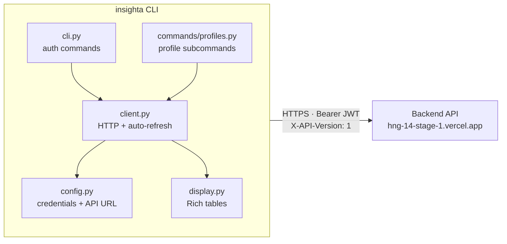
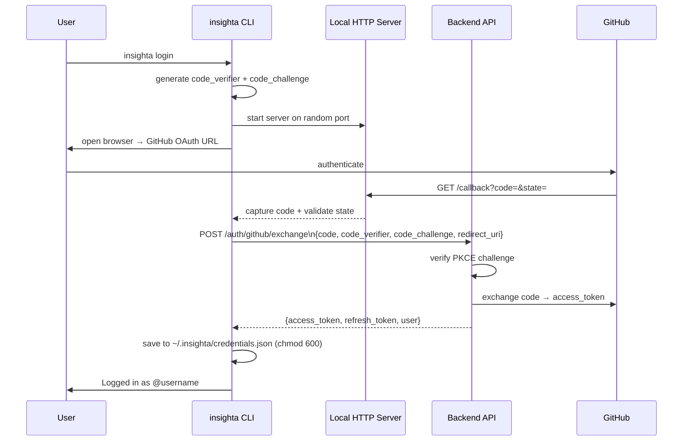

# Insighta Labs+ — CLI

Command-line interface for the Insighta Labs+ profile intelligence platform. Authenticates via GitHub OAuth with PKCE, auto-refreshes tokens, and renders results as rich terminal tables.

---

## Installation

**Option 1 — Install directly from GitHub (recommended for testing):**

```bash
pip install git+https://github.com/NgBlaze/hng_14_CLI.git
```

**Option 2 — Clone and install in editable mode (for development):**

```bash
git clone https://github.com/NgBlaze/hng_14_CLI.git
cd hng_14_CLI
pip install -e .
```

The `insighta` command is now available globally:

```bash
insighta --help
```

---

## System Architecture



**Credential storage:** `~/.insighta/credentials.json` (permissions: `600`)

---

## Authentication Flow

The CLI uses GitHub OAuth with **PKCE** (Proof Key for Code Exchange) — no client secret is ever exposed on the user's machine.



```
insighta login
     │
     ├─ generate code_verifier  (32 random bytes, base64url-encoded)
     ├─ code_challenge = base64url(SHA-256(code_verifier))
     │
     ├─ start temporary local HTTP server on a random port
     ├─ open browser → GitHub OAuth page
     │
     │   User authenticates on GitHub
     │   GitHub redirects → http://127.0.0.1:<port>/callback?code=...
     │
     ├─ local server captures code + state
     ├─ validate state matches (CSRF protection)
     │
     ├─ POST /auth/github/exchange
     │     { code, code_verifier, code_challenge, redirect_uri }
     │
     │   Backend verifies PKCE, exchanges code with GitHub,
     │   creates/updates user, issues JWT pair
     │
     └─ save access_token + refresh_token to ~/.insighta/credentials.json
```

---

## Token Handling

| Token | Expiry | Stored at |
|---|---|---|
| Access token | 3 minutes | `~/.insighta/credentials.json` |
| Refresh token | 5 minutes | `~/.insighta/credentials.json` |

Every request goes through `client.request()` which:

1. Reads tokens from `credentials.json`
2. Attaches `Authorization: Bearer <access_token>` and `X-API-Version: 1`
3. On `401` response → automatically calls `POST /auth/refresh`
4. If refresh succeeds → saves new tokens, retries original request transparently
5. If refresh fails → clears credentials and exits with a re-login prompt

The user never manually manages token expiry.

---

## Commands

### Auth

```bash
insighta login          # GitHub OAuth login (opens browser)
insighta logout         # Revoke session + clear local credentials
insighta whoami         # Show current user details
```

### Profiles

#### List

```bash
insighta profiles list
insighta profiles list --gender male
insighta profiles list --gender female --country NG
insighta profiles list --age-group adult
insighta profiles list --min-age 25 --max-age 40
insighta profiles list --sort-by age --order desc
insighta profiles list --page 2 --limit 20
```

#### Get

```bash
insighta profiles get <profile-id>
```

#### Search (natural language)

```bash
insighta profiles search "young males from Nigeria"
insighta profiles search "adult women in Germany"
insighta profiles search "seniors above 60"
insighta profiles search "teenagers between 13 and 17"
```

#### Create (admin only)

```bash
insighta profiles create --name "Harriet Tubman"
```

#### Export to CSV

```bash
insighta profiles export                          # all profiles
insighta profiles export --gender male            # filtered
insighta profiles export --country NG --age-group adult
```

Saves the CSV file to the current working directory with a timestamped filename (e.g. `profiles_20260427_120000.csv`).

---

## Options Reference

| Option | Values | Commands |
|---|---|---|
| `--gender` | `male`, `female` | `list`, `export` |
| `--age-group` | `child`, `teenager`, `adult`, `senior` | `list`, `export` |
| `--country` | ISO 3166-1 alpha-2 code (e.g. `NG`, `DE`) | `list`, `export` |
| `--min-age` | integer | `list`, `export` |
| `--max-age` | integer | `list`, `export` |
| `--sort-by` | `age`, `created_at`, `gender_probability` | `list`, `export` |
| `--order` | `asc`, `desc` | `list`, `export` |
| `--page` | integer ≥ 1 | `list`, `search` |
| `--limit` | integer ≥ 1 | `list`, `search` |

---

## Role Enforcement

The CLI reflects server-side role enforcement — no client-side access control logic:

- `insighta profiles create` → returns `403 Forbidden` if the logged-in user is not an admin; the CLI surfaces the error clearly.
- Read commands (`list`, `get`, `search`, `export`) are available to all authenticated users.

---

## Configuration

| Environment variable | Default | Description |
|---|---|---|
| `INSIGHTA_API_URL` | `https://hng-14-stage-1.vercel.app` | Backend API base URL |
| `INSIGHTA_GITHUB_CLIENT_ID` | (built-in) | GitHub OAuth App client ID |

---

## Development

```bash
git clone https://github.com/NgBlaze/hng_14_CLI.git
cd hng_14_CLI
python -m venv venv && source venv/bin/activate
pip install -e ".[dev]"

# Lint
ruff check insighta/

# Tests
pytest tests/
```

### CI/CD

GitHub Actions runs on every PR to `main`:
- `ruff` lint check
- `pytest` test suite

See `.github/workflows/ci.yml`.
